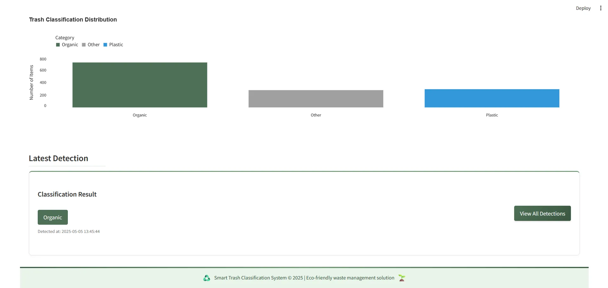
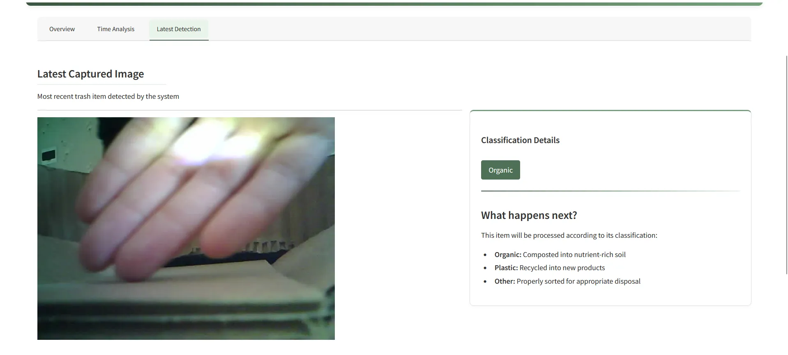

# 🗑️ Shijin Forge – Smart Trash Bin using AI & IoT

A smart trash-sorting prototype built for the **Samsung Innovation Campus Hackathon**, capable of sorting waste into categories in real time using a custom-trained CNN model and ESP32 microcontroller.

---

- See our streamlit web here: https://shijinforgesmartbin.streamlit.app/
- See our Youtube Final Pitching & Demo here: https://youtu.be/JbN-0TZBvRU
- See our Youtube Code Explanation here: https://youtu.be/25jmLoOJSeo
- 

---

## 📸 Demo

---

## 🧠 Features

- AI-based waste classification (Organic, Plastic, Others)
- Custom-trained CNN model with 45,000 image samples
- Servo control and ESP32 camera integration
- Real-time motion detection & sorting in <2 seconds
- Streamlit interface for demonstration

---

## 🛠 Tech Stack

- **Backend**: Python, Flask, Streamlit
- **AI Model**: TensorFlow, Keras, MobileNetV2
- **IoT**: ESP32, MicroPython, Servo, Motion Sensors
- **Others**: GitHub for collaboration, iCrawler for scraping dataset

---

## 🤝 Team

- **My Role**: Backend engineer, API architect, and streamlit visualization  
- Helped lead the system integration and workflow planning

---

## 📚 What I Learned

- My first time working with deep learning and ESP32 microcontrollers
- Learned to optimize a smart system end-to-end: AI → Hardware → UX
- Overcame challenges in real-time performance and hardware-software communication
- Gained leadership and collaboration skills using GitHub in a real team setting

---

## 🏅 Recognition

Quarter-finalist at Samsung Innovation Campus Batch 6 Hackathon

---

## 📎 License

Apache 2.0 – educational purposes only
